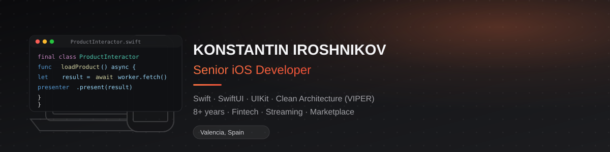

### Konstantin Iroshnikov — Senior iOS Developer

Building and scaling native iOS apps (Swift, SwiftUI, Objective-C) for 8+ years — fintech, streaming, and marketplace platforms. Based in Valencia, Spain 🇪🇸.

**Highlights**
- 🚀 Cut project build time by 25% by extracting a legacy module into an independent Swift Package
- ⚡️ Redesigned deep-link routing, cutting new-feature implementation time from 6–8h to 1–2h (~75% faster)
- 📈 Launched a partner-service app that grew user acquisition by 15%
- 🧑‍🏫 Mentored 50+ junior iOS developers, raising client interview pass rates by 20%
- 🛠 Set up CI/CD pipelines that accelerated the dev–test–bugfix cycle by 60%

**Currently**: modularizing legacy UIKit apps into Clean Swift (VIP/VIPER) packages, and bridging SwiftUI into existing UIKit codebases via `UIViewRepresentable` / `UIHostingController` with Combine-based routing.

📫 [LinkedIn](https://www.linkedin.com/in/konstantin-iroshnikov) · konstantin.singlton92@gmail.com
